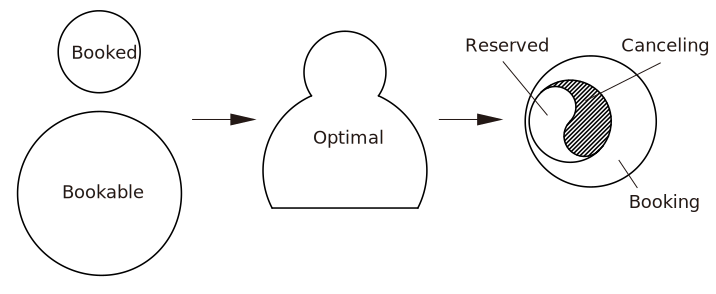

# 中国科学技术大学EPC系统自动抢课脚本


版本 v2.0 更新日志(2020_02_21):
- 支持自动选课, 根据**课表优化算法**自动优化课表.
- 支持**选课时段**和**EPC课程类型**的自定义筛选.
- 支持**邮件提醒**, 课表更新时系统自动通知.
- 支持 Windows 10 系统的**桌面提醒**, 课表更新时系统自动通知.
- 提供**图形化操作界面**.
- 实现原理从 Selenium 方式转为 Requests 方式, 性能提升.

## 目录

- [安装及使用](#安装及使用)
    + [针对普通用户](#针对普通用户)
    + [针对开发者](#针对开发者)
- [课表优化算法](#课表优化算法)
- [参考文献](#参考文献)

## 安装及使用

### 针对普通用户

- 步骤1: 在 [Release](https://github.com/Arsennnic/ustc-epc-bot/releases) 页面下载最新版本.
- 步骤2: 解压并双击运行 `epc_bot.exe` 文件.
- 步骤3: 在设置面板中输入自己的学号, 密码, 邮箱地址及邮箱密码, 勾选允许预约的课程类型及时段, 并点击 Start 按钮. 相关设置会保存在本地的 `config.json` 文件中, 此后每次打开都会自动填充上一次的设置. 
- 步骤4: 当有新的课程被预约, 系统将自动发送通知.

<p align="center">
    
</p>

### 针对开发者

- 步骤1: 将项目克隆至本地.
```
$ git clone https://github.com/Arsennnic/ustc-epc-bot.git
```
- 步骤2: 安装相关依赖包.
```
$ cd ustc-epc-bot/
$ pip install -r requirements.txt
```
- 步骤3: 运行 `main.py` 文件.
```
$ python main.py
```

## 课表优化算法

- 通过脚本抓取已选课程 Booked 与可选课程 Bookable 的数据, 分别存放在对应的列表里.
- 取 Booked 与 Bookable 的并集, 并对所有数据排序: 上课时间对应时间戳从小到大排列, 学时从大到小排列.
- 遍历排序后的并集中的所有数据, 删除上课时间重复的数据; 取前若干个学时之和不大于上限的课程, 存放在列表 Optimal 中, 得到课程安排**最优解**.
- 求 Optimal 与 Booked 的交集记为 Reserved, 对应EPC课程将不作变动.
- 求 Booked 与 Reserved 的差集记为 Canceling, 对应EPC课程将被**取消预约**.
- 求 Optimal 与 Bookable 的交集记为 Booking, 对应EPC课程将被**预约**.

<p align="center">
    
</p>

## 参考文献

[1] 木华生. 中科大EPC课程爬取[OL]. https://blog.csdn.net/qq_28491207/article/details/84261732, 2018.  
[2] David Cortesi, William Caban. PyInstaller Manual[OL]. https://pyinstaller.readthedocs.io/.  
[3] AhmedWas. Getting Rid of ChromeDirver Console Window with PyInstaller[OL]. https://stackoverflow.com/questions/52643556/getting-rid-of-chromedirver-console-window-with-pyinstaller, 2018.
