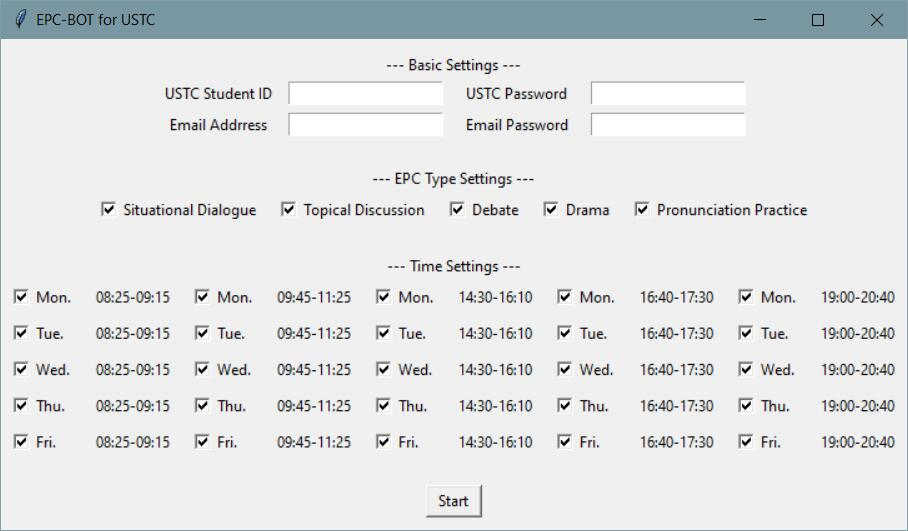
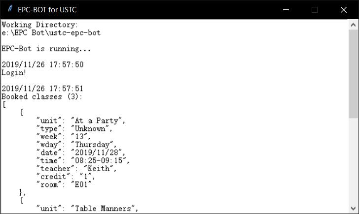
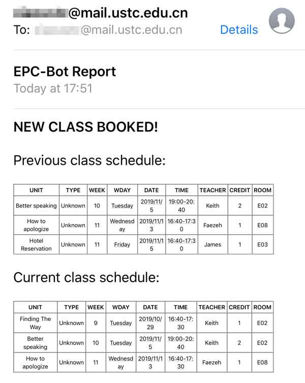

# 中国科学技术大学EPC系统自动抢课脚本


版本 v1.0 更新日志(2019_11_26):
- 支持自动选课, 根据**选课逻辑算法**自动优化课表.
- 支持选课时段的自定义设置.
- 支持邮件提醒, 课表更新时系统自动发送.
- 提供图形化操作界面.

## 目录

- [安装及使用](#安装及使用)
    + [针对普通用户](#针对普通用户)
    + [针对开发者](#针对开发者)
- [实现原理](#实现原理)
- [选课逻辑算法](#选课逻辑算法)
    + [未达预约上限的情况](#未达预约上限的情况)
    + [已达预约上限的情况](#已达预约上限的情况)
- [参考文献](#参考文献)

## 安装及使用

### 针对普通用户

- 步骤0: 确认自己的电脑已安装 Chrome 浏览器.
- 步骤1: 在 [Release](https://github.com/Arsennnic/ustc-epc-bot/releases) 页面下载最新版本.
- 步骤2: 解压并双击运行 epc_bot.exe 文件.
- 步骤3: 在设置面板中输入自己的学号, 密码, 邮箱地址及邮箱密码, 勾选可以预约的时段, 并点击 Start 按钮. 相关设置会保存在本地的 config.json 文件中, 此后每次打开都会自动填充上一次的设置.  

<p align="center">
    
</p>

- 步骤4: 自动选课脚本开始运行. 系统会自动获取并优化当前已预约的课程列表.  

<p align="center">
    
</p>

- 步骤5: 当有新的课程被预约, 系统将自动发送通知邮件.  

<p align="center">
    
</p>

### 针对开发者

- 步骤0: 确认自己的电脑已安装 Chrome 浏览器和 Python 3.x 开发环境.
- 步骤1: 将项目 Clone 至本地.
```
$ git clone https://github.com/Arsennnic/ustc-epc-bot.git
```

- 步骤2: 运行 main_gui.py 文件.
```
$ cd ustc-epc-bot/
$ python main_gui.py
```


## 实现原理

- 利用 requests.Session() 抓取 Cookie 信息, 绕过验证码检测.
- 将 Cookie 信息传入后台开启的 Chrome Headless 浏览器模拟登录, 抓取已预约课程列表, 并循环刷新可预约课程列表.
- 通过 selenium.*element*.click() 模拟按钮点击等操作, 优化已预约课程列表.
- 通过 smtp.sendmail() 发送邮件.

## 选课逻辑算法

### 未达预约上限的情况

- 结合筛选规则, 获取可预约课程列表.
- 预约日期最早的课程. 若存在1学时课程与2学时课程的日期相同, 优先选择2学时课程.
- 循环上述操作, 直至到达预约上限(4学时).

### 已达预约上限的情况

- 检查已预约课程的总学时. 若未达预约上限(4学时), 则先预约课程至预约上限(4学时).
- 结合筛选规则, 获取可预约课程列表.
- 比较可预约课程与已预约课程的时间先后. 若存在可预约课程的日期早于已预约课程中的最晚日期, 则考虑进行一次课程替换. 若存在1学时课程与2学时课程的日期相同, 优先选择2学时课程.
- 将已预约课程按照日期先后排列, 共有五种学时组合, 分别讨论之:
    + 组合I (1, 1, 1, 1): 
        - 可预约课程为2学时: 
            + 可预约课程日期早于已预约的倒数第2节课, 将倒数第1-2节已预约课程替换为可预约课程.
            + 可预约课程日期晚于已预约的倒数第2节课, 不替换.
        - 可预约课程为1学时: 
            + 将倒数第1节已预约课程替换为可预约课程.
    + 组合II (1, 1, 2): 
        - 可预约课程为2学时: 
            + 将倒数第1节已预约课程替换为可预约课程.
        - 可预约课程为1学时: 
            + 可预约课程日期早于已预约的倒数第2节课, 将倒数第1-2节已预约课程替换为可预约课程.
            + 可预约课程日期晚于已预约的倒数第2节课, 不替换.
    + 组合III (1, 2, 1): 
        - 可预约课程为2学时: 
            + 可预约课程日期早于已预约的倒数第2节课, 将倒数第2节已预约课程替换为可预约课程.
            + 可预约课程日期晚于已预约的倒数第2节课, 不替换.
        - 可预约课程为1学时: 
            + 将倒数第1节已预约课程替换为可预约课程.
    + 组合IV (2, 1, 1): 
        - 可预约课程为2学时: 
            + 可预约课程日期早于已预约的倒数第2节课, 将倒数第1-2节已预约课程替换为可预约课程.
            + 可预约课程日期晚于已预约的倒数第2节课, 不替换.
        - 可预约课程为1学时: 
            + 将倒数第1节已预约课程替换为可预约课程.
    + 组合V (2, 2): 
        - 可预约课程为2学时: 
            + 将倒数第1节已预约课程替换为可预约课程.
        - 可预约课程为1学时: 
            + 可预约课程日期早于已预约的倒数第2节课, 将倒数第1节已预约课程替换为可预约课程(*注: 此操作将导致已预约总学时低于上限*).
            + 可预约课程日期晚于已预约的倒数第2节课, 不替换.
- 循环上述操作, 直至可预约的课程列表为空.

## 参考文献

[1] 木华生. 中科大EPC课程爬取[OL]. https://blog.csdn.net/qq_28491207/article/details/84261732, 2018.
[2] David Cortesi, William Caban. PyInstaller Manual[OL]. https://pyinstaller.readthedocs.io/.
[3] AhmedWas. Getting Rid of ChromeDirver Console Window with PyInstaller[OL]. https://stackoverflow.com/questions/52643556/getting-rid-of-chromedirver-console-window-with-pyinstaller, 2018.
