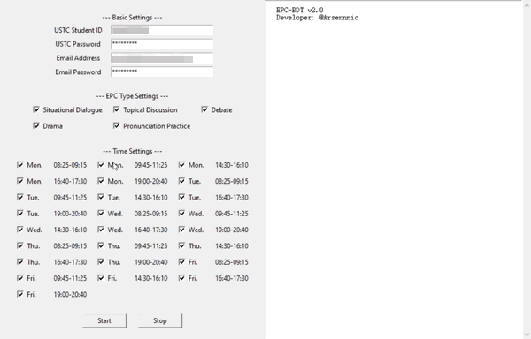

# 中国科学技术大学EPC系统自动抢课脚本


版本 v2.1 更新日志(2020_03_30):
- 支持自动选课, 根据**课表优化算法**自动优化课表.
- 支持**课程时间**和**课程类型**的自定义筛选.
- 支持**邮件提醒**, 课表更新时系统自动通知.
- 支持 Windows 10 系统的**桌面提醒**, 课表更新时系统自动通知.
- 提供**图形化操作界面**.
- 实现原理从 Selenium 方式转为 Requests 方式, 并采用**多线程**, 效率提升.

## 目录

- [安装及使用](#安装及使用)
    + [针对普通用户](#针对普通用户)
    + [针对 Python 程序员](#针对-python-程序员)
- [课表优化算法](#课表优化算法)
- [开发及测试人员](#开发及测试人员)
- [参考文献](#参考文献)

## 安装及使用

### 针对普通用户

- 步骤1: 在 [Releases](https://github.com/Arsennnic/ustc-epc-bot/releases) 页面下载最新版本.
- 步骤2: 解压并双击运行 `epc_bot.exe` 文件.
- 步骤3: 在设置面板中输入自己的学号, 密码, 邮箱地址及邮箱密码, 勾选允许预约的课程类型及时段, 并点击 Start 按钮. 相关设置会保存在本地的 `config.json` 文件中, 此后每次打开都会自动填充上一次的设置. 
- 步骤4: 当有新的课程被预约, 系统将自动发送通知.

<p align="center">
    
</p>

### 针对 Python 程序员

- 步骤1: 将项目克隆至本地.
    ```batch
    git clone https://github.com/Arsennnic/ustc-epc-bot.git
    ```
- 步骤2: 安装相关依赖包.
    ```batch
    cd ustc-epc-bot/
    pip install -r requirements.txt
    ```
- 步骤3: 运行 `main.py` 文件.
    ```batch
    python main.py
    ```

## 课表优化算法

- 通过脚本抓取已选课程 Booked 与可选课程 Bookable 的数据.
- 取 Booked 与 Bookable 的并集 All, 并对其排序: 
  - 上课时间: 先→后;
  - 课程学时: 大→小;
  - 是否已经预约: 是→否.
- 遍历排序后的 All 中的所有数据: 
  - 若课程单元或课程时间与 Optimal 中已有的数据重复, 跳过; 
  - 否则, 将该课程添加到 Optimal 中, 直至 Optimal 中课程学时总和达到上限
- 计算课程安排**最优解**:
  - 求 Optimal 与 Booked 的交集记为 Reserved, 对应课程将不作变动;
  - 求 Booked 与 Reserved 的差集记为 Canceling, 对应课程将被**取消**;
  - 求 Optimal 与 Bookable 的交集记为 Booking, 对应课程将被**预约**.
- 根据最优解取消/预约相应课程. 

<p align="center">
    
</p>

## 开发及测试人员

<span>&nbsp;&nbsp;&nbsp;&nbsp;</span>
<a href="https://github.com/Arsennnic">
    
</a>
<span>&nbsp;&nbsp;</span>
<a href="https://github.com/hooooooot">
    
</a>


## 参考文献

- 木华生. 中科大EPC课程爬取[OL]. https://blog.csdn.net/qq_28491207/article/details/84261732, 2018.  
- John W. Shipman. Tkinter reference: a GUI for Python[J]. New Mexico Tech Computer Center, 2001.  
- David Cortesi, William Caban. PyInstaller Manual[OL]. https://pyinstaller.readthedocs.io/.  
